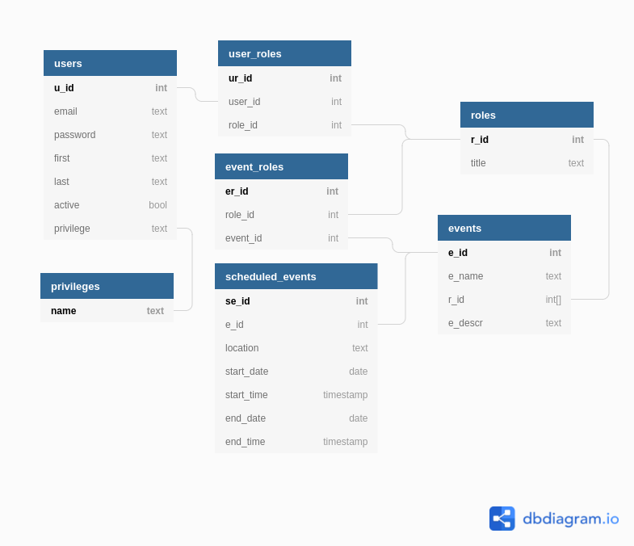

# Capstone Two: Step Two - Write a Project Proposal

1. ### What tech stack will you use for your final project? We recommend that you use React and Node for this project, however if you are extremely interested in becoming a Python developer you are welcome to use Python/Flask for this project.
   - express/node and react
2. ### Is the front-end UI or the back-end going to be the focus of your project? Or are you going to make an evenly focused full-stack application?
   - both front and back...my interest lies with my church's mobile app, both the front end and back end are old. I hope to revamp both.
3. ### Will this be a website? A mobile app? Something else?
   - in order to be deployed to my congregation, this will have to become a mobile app. I will not be making a mobile app for my capstone though. It will remain a website.
4. ### What goal will your project be designed to achieve?

   - ## The problem:
     - At church, there are volunteers. The places requiring volunteers are the coffee bar, the worship team, and childrens church. People can volunteer at any place.
     - Currently, a pastor (Jason) schedules the worship team, our administrator (Christa) schedules the children's church workers, and a congregant (Tifa) schedules the coffee bar workers.
     - Jason, Christa, and Tifa do not coordinate with each other. Occasionally, Christa and Tifa will schedule the same person for two roles on a single Sunday. Tifa occasionally will schedule someone who has only been trained on the cash register. (the children’s church people are really good at what they do, actually, so I can’t complain about them)
   - ## The basic solution:
     - All roles require training/onboarding, some roles require further training (i.e. refilling the drip coffee vs making an iced oat milk flat white vanilla steamer), some require a background check
     - An admin (such as Jason, Christa, or Tifa) should be able to quickly and easily schedule a volunteer without thinking about whether or not they are qualified.
     - An admin would be able to check-off “completed barista training” or “bassist” or “completed lead teacher training” so that those roles would be added to that volunteer
     - A volunteer would be able to go in and schedule themselves for roles that only they are qualified for without needing to bother an admin.
   - ## The ticket to a super cool and complete capstone:
     - The backend will auto-schedule volunteers one month out
     - This means that the volunteers would need to either acknowledge the invite (mayyyyybe through email), decline the invite, or the invite would time out, at which point, the volunteer would be added to the schedule or the backend would send an invite to someone else to be scheduled.
   - ## Bonus pts:
     - Let volunteers integrate their google calendar so that neither the backend’s auto-schedule function nor an admin cannot schedule them on a day that is blocked on their calendar.

5. ### What kind of users will visit your app? In other words, what is the demographic of your users?
   - the app will stay in my christian church here in northern Virginia. Other local churches have expressed interest in our old app, however, and we might attempt to make it more generic.
6. ### What data do you plan on using? How are you planning on collecting your data? You may have not picked your actual API yet, which is fine, just outline what kind of data you would like it to contain. You are welcome to create your own API and populate it with data. If you are using a Python/Flask stack are required to create your own API.
   - my own data. my database will be populated from scratch. At most I might import some bogus usernames and roles.
   - I MIGHT use something like a calendar API to make date manipulation / event creation easier.
   - If I have the time, I will integrate with google calendar.
7. ### In brief, outline your approach to creating your project (knowing that you may not know everything in advance and that these details might change later). Answer questions like the ones below, but feel free to add more information:
   <ol>
   <li type="a">What does your database schema look like?</li>
       - See "database_schema.png" (shown below). Will be highly role and time driven.
   <li type="a">What kinds of issues might you run into with your API? This is especially important if you are creating your own API, web scraping produces notoriously messy data.</li>
        - Some tasks will be scheduled (e.g. weekly volunteer scheduling), which I have not had to implement before. That might become messy, but I don't expect there to be challenges in keeping the data valid within the schema I create
   <li type="a">Is there any sensitive information you need to secure?</li>
        - passwords are the only sensitive info.
   <li type="a">What functionality will your app include?</li>
        - volunteer auto-schedule
        - email notification
        - google calendar integration
        - users with multiple roles
        - different levels of access amongst different user roles
   <li type="a">What will the user flow look like?</li>
        1. sign-in
        2. look at volunteer calendar
        3. choose day to volunteer
        4. click submit
        OR
        1. Receive email notifying user that they have been placed on the schedule.
        2. User will click "confirm"
   <li type="a">What features make your site more than a CRUD app? What are your stretch goals?</li>
        - not sure it will be more than CRUD
   </ol>

